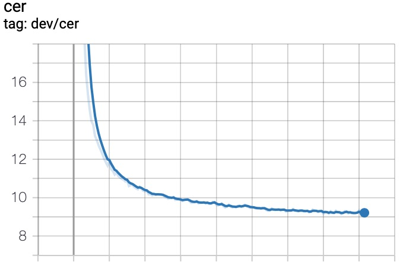

**Speech Recognition**

dataset: aishell1 

Setup:

    1.run docker
    2.setup beamdecodectc followed as [this repo]<https://github.com/libai3/masr>
use:

    download aishell:
        bash scripts/data/download_aishell.sh
        
    preprocess:
        bash scripts/data/*
        bash scripts/train/*
        
result:

    beam decode with lm cer:7.2 

curves:

  